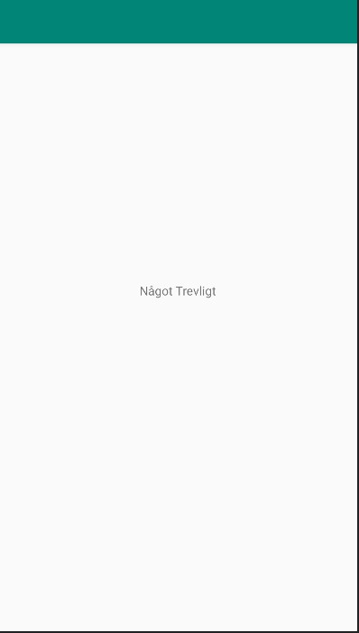

# Rapport

Ett Github konto skapades med skolans email, denna användes för att skapa en branch (en separeat kopia) av coden som
nu kan ändras utan att orginale koden berörs. den kopian clonades sedan till det lokala repositorien.

En ändring i filen activity_Main.xml gjordes, vid raden där det innan stod __android:text="Hello World!"__, står det nu mera __android:text="Något Trevligt"__.
Det ändringen gjorde var att byta ut texten från *Hello World!* till *Något Trevligt*.


```
 <TextView
        android:layout_width="wrap_content"
        android:layout_height="wrap_content"
        android:text="Något Trevligt"        // ändrat från Hello World
        app:layout_constraintBottom_toBottomOf="parent"
        app:layout_constraintLeft_toLeftOf="parent"
        app:layout_constraintRight_toRightOf="parent"
        app:layout_constraintTop_toTopOf="parent" />
```




