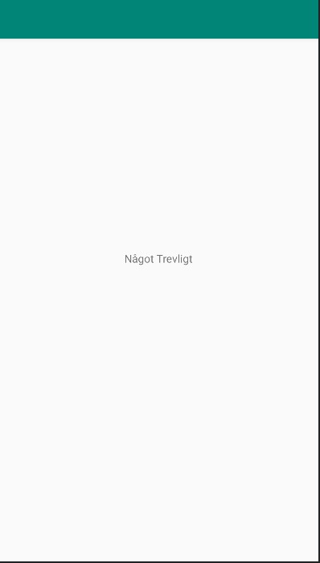

# Rapport

Ett Github konto skapades med skolans email, denna användes för att skapa en branch (en separeat kopia) av koden som
nu kan ändras utan att orginale koden berörs. den kopian clonades sedan till det lokala repositorien.

En ändring i filen `content_main.xml` gjordes, vid raden där det tidigare stod __android:text="Hello World!"__, står det nu mera __android:text="@string/NågotTrevligt"__.
Det ändringen gjorde var att skapa en sting variabel under values/string med innehållet "Något Trevligt" som nås från raden där *Hello World!* tidigare stod.


```
 <TextView
        android:layout_width="wrap_content"
        android:layout_height="wrap_content"
        android:text="@string/NågotTrevligt"        // ändrat från Hello World
        app:layout_constraintBottom_toBottomOf="parent"
        app:layout_constraintLeft_toLeftOf="parent"
        app:layout_constraintRight_toRightOf="parent"
        app:layout_constraintTop_toTopOf="parent" />
```




